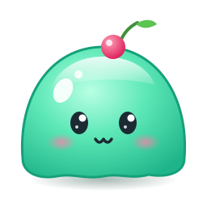
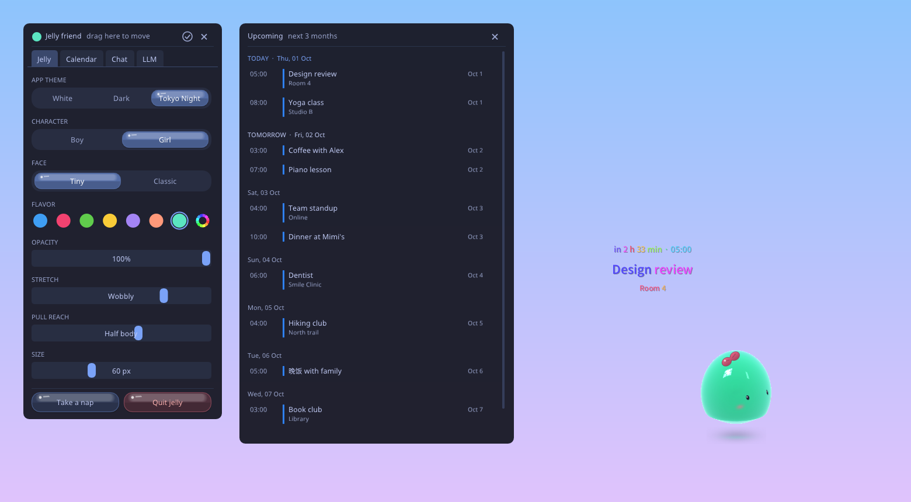
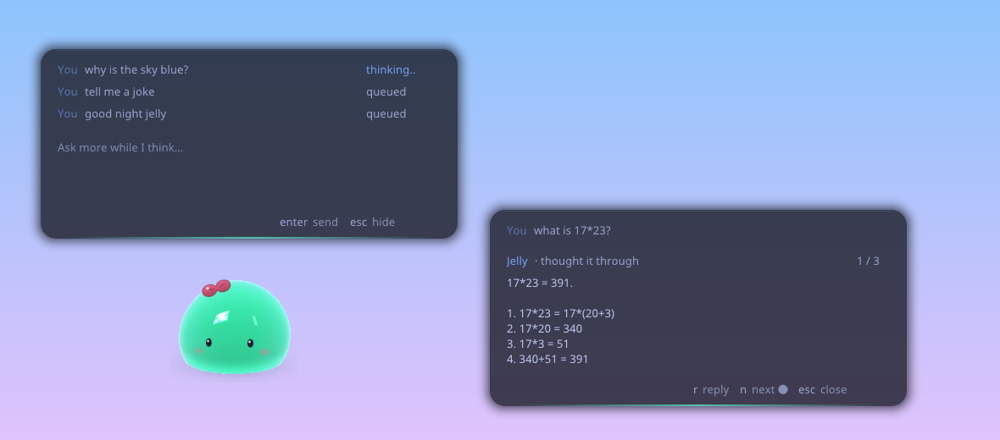
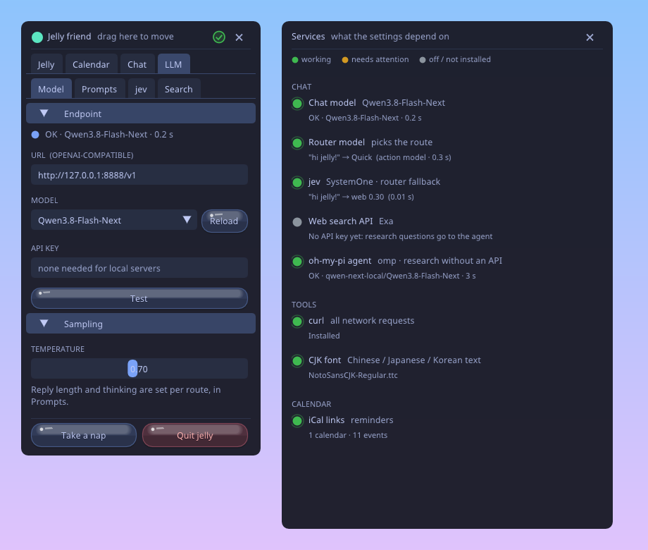
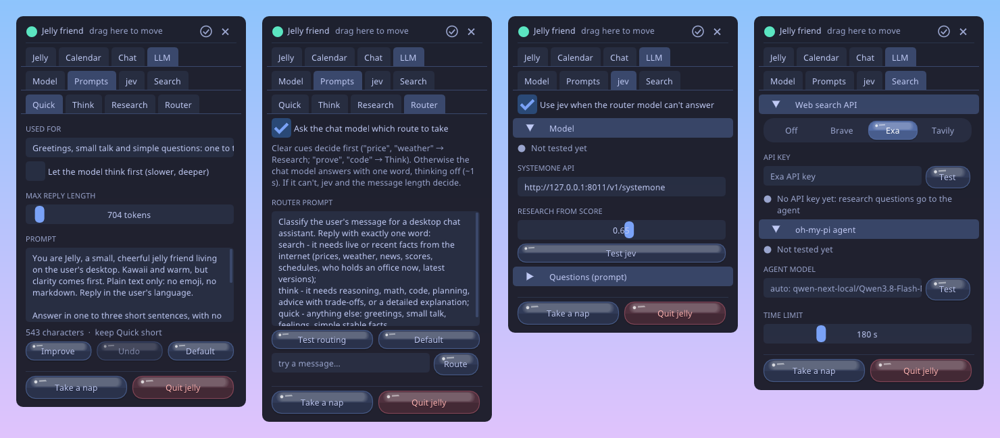
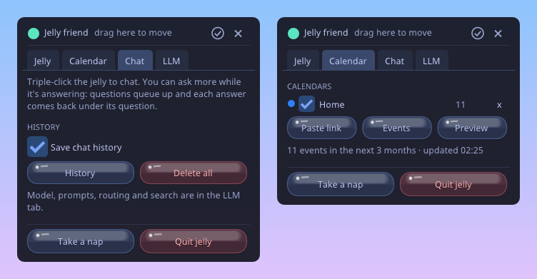
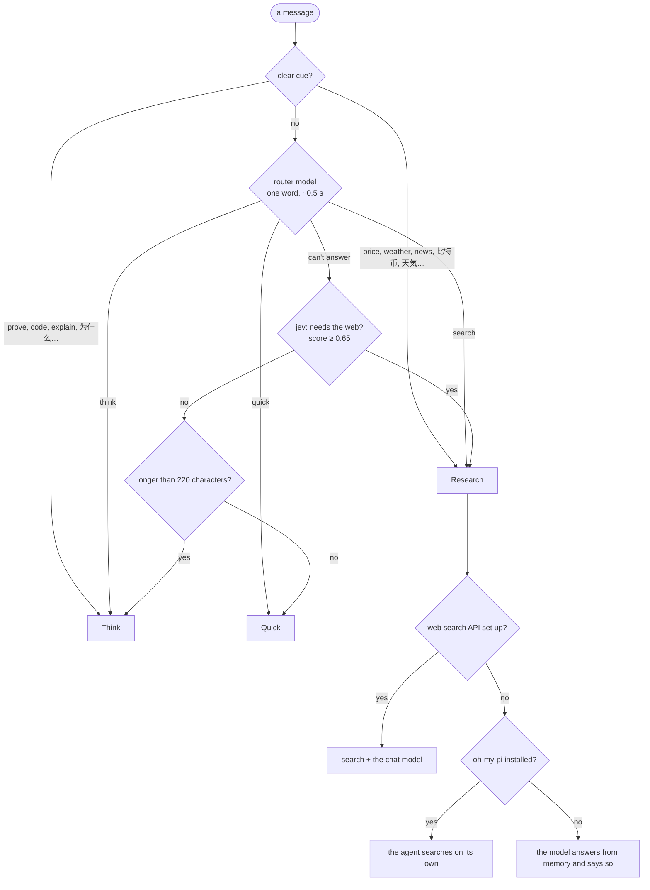

[](https://github.com/jstdlee/jev-jelly/actions/workflows/build.yml)
[](https://github.com/jstdlee/jev-jelly/releases/latest)



# jev-jelly

A squishy jelly friend that lives on your desktop: it hops around, wobbles when you poke it, stretches when you pull
it, reminds you of what's coming up on your calendar, and chats with you through your own language model. It has
no window frame, and clicks go through everywhere except its body. Linux (X11) and Windows 10 / 11.



## Gallery

| | |
|---|---|
|  |  |
| **Chat.** Ask more while it's thinking: questions queue up, then each answer comes back under its question. `r` reply, `n` / `p` next and previous. | **Test all.** One click checks everything the settings depend on: green works, yellow needs attention, gray is off or not installed. |



**The LLM tab:** one prompt per route (Quick shown), the router model, jev (SystemOne), web search and the agent.



*(Screenshots come from the app itself, saving its own surfaces with their transparency: see "Debugging" below.
The calendar in them is made up.)*

## Features

### The jelly

- **Pinch & pull**: the spot you grab stretches toward the cursor with a thinning neck. Past the stretch limit the
  body is towed along. Let go and the lump snaps back and ripples. **Throw** it: it glides and splats off the
  screen edges.
- **Put it somewhere** (drag and let go) and it stays there quietly for 5 minutes before wandering again. In a
  corner it naps (zzz).
- **Moods:** *curious* when your cursor comes close (stops, stretches up, big eyes); a head tilt and a **?** if
  the cursor stays still; *smiles* after gentle pets and *laughs* when tickled or poked; sometimes *hurries* to a
  far spot with sweat drops and dust; now and then *looks back* over its shoulder.
- **Click** to poke (four quick pokes make it dizzy). **Wiggle the cursor** over it to pet it (hearts).
- Boy / Girl, two face styles, 7 flavors or any color, opacity, stretchiness, pull reach and size, all live.

### Chat

- **Triple-click** the jelly. A translucent line to type in fades in beside it with the keyboard ready (IME typing
  for Japanese, Chinese and Korean works, and so does Ctrl+V).
- **Keep asking.** After you send, the box stays open: questions still waiting are listed above the input (the
  current one "thinking…", the rest "queued") and are answered in order. The jelly bounces, thinks with little
  dots, and cheers for each answer.
- **Each answer shows under its question**, game-dialogue style, with how it was answered ("thought it through",
  "searched the web", "asked the agent") and where it is in the conversation (`2 / 5`).
- **Keys:** `r` reply · `n` next answer · `p` previous answer · `Enter` next if there is one, else reply ·
  `Esc` hide (it keeps answering; one click on the jelly brings the box back).
- **Move it** by dragging anywhere that isn't a control. It stays where you put it for the rest of the
  conversation.
- Works with any **OpenAI-compatible** endpoint (a local TensorFold / vLLM / Ollama server, or a hosted API). The
  default personality is kawaii, cheerful, caring and curious, with safety guidance built in.
- History is saved in `chat-history.jsonl` (mode 600) unless you switch that off; view or delete it in the Chat tab.

### The decision chain: which route answers a message

Every message goes to one of three **routes**, each with its own prompt, reply length and thinking setting:

| Route | For | Prompt |
|---|---|---|
| **Quick** | greetings, small talk, simple stable facts | deliberately tiny: one to three sentences back |
| **Think** | reasoning, math, code, planning, comparisons | work it out first; conclusion first, then numbered steps |
| **Research** | prices, weather, news, scores, schedules, latest versions | answer from fresh results, with numbers, dates and sources |



1. **Cues** decide instantly. Words that are common in small talk ("today", "now") are left out on purpose, so
   "how are you today?" stays Quick.
2. The **router model** is the chat model itself with thinking off, asked for a single word (`quick`, `think` or
   `search`). Its prompt is editable (LLM → Prompts → Router).
3. **jev** is the fallback when the router model can't answer: a jev model behind the SystemOne API (for example a
   local Julia-1 on :8011), asked one yes/no question: "Would you need to look this up on the internet today to
   answer correctly?". Its score must reach the threshold (default 0.65, adjustable).
4. **Length**: anything longer than 220 characters goes to Think.

How the router was chosen, measured on labelled messages (22 used while tuning plus 14 held out):

| Router | Tuning set | Held out | Time |
|---|---|---|---|
| jev (Julia-1), multi-option "choice" | ignores the message: same answer every time | | 0.01 s |
| jev (Julia-1), yes/no "needs the web" | 91% (separates search only) | 8 / 14 | 0.02 s |
| cues + router model (Qwen3.8-Flash, thinking off) | 22 / 22 | 14 / 14 | ~0.5 s |

### Models and services

- **Chat model**: any OpenAI-compatible `/v1/chat/completions` endpoint. Pick the model from the server's
  `/v1/models` list; each route sets its own reply length and whether the model thinks first.
- **Router model**: the same endpoint and model, asked for one word.
- **jev (SystemOne)**: the fallback router; its URL, threshold and question set are in LLM → jev.
- **Web search**: Brave, Exa or Tavily with your API key. The top results go to the model with the question.
- **oh-my-pi agent** (`omp`): answers Research questions when there's no search API, with its own web search
  (saying "use omp to …" or "look it up online" sends a message there too). It
  is told to use your chat model: the provider in `~/.omp/agent/models.yml` that serves the same endpoint (or a
  model you set). Without that, omp would fall back to its own default model.
- **Test all** (the check icon in the settings header) checks all of these, plus `curl`, the CJK font and your
  calendars, with a light each.
- API keys are passed to `curl` on stdin, never on the command line. Settings are in `llm.conf` (mode 600).

### Calendar reminders

- Add your calendar's secret iCal link (right-click → Calendar → *Paste link*). Up to 10 calendars, each with an
  event count and an on/off switch; **Events** lists the next 3 months.
- When you're at the desk (keyboard or mouse used in the last minute), an upcoming event appears beside the jelly
  as solid words, each in its own slowly shifting color, and pixel-dissolves in and out. Click it to dismiss it;
  otherwise it goes after 10 minutes. Each event shows at most three times: a heads-up (70 min to 48 h ahead),
  one 15–70 minutes before, and one as it starts.
- Recurring events (daily / weekly / monthly / yearly, BYDAY, COUNT, UNTIL), exceptions, cancellations, all-day
  events and time zones (IANA and Outlook's Windows names) are handled. CJK titles use a matching font.
- *Google Calendar:* Settings → your calendar → Integrate calendar → **Secret address in iCal format** (no sign-in
  or app registration). Outlook, iCloud and Fastmail share links work too. The links are stored privately
  (`calendars`, mode 600), since anyone with a link can read that calendar.

### Settings

**Right-click** the jelly. The panel comes up above other windows; drag it by its header. Tabs: **Jelly** (theme:
White / Dark / Tokyo Night; character, face, flavor, opacity, stretch, pull reach, size), **Calendar**, **Chat**
(history) and **LLM** (sub-tabs **Model**: endpoint, model, key and sampling, in collapsible groups; **Prompts**:
Quick / Think / Research / Router; **jev**: its model and its questions; **Search**: the web search API and the
agent). Changes apply live. "Take a nap" and "Quit jelly" are at the bottom.

## Download

Every push to `main` builds a release: **[Releases](https://github.com/jstdlee/jev-jelly/releases/latest)**.

- **Linux** (x86_64, aarch64): unpack, run `./jelly &`. `scripts/install-desktop.sh` adds a **Jelly** icon to the
  desktop and the app menu (only one jelly runs at a time; `--remove` takes it away). Built on Ubuntu 24.04:
  glibc 2.39 or newer, plus the usual `libX11`, `libXext` and `libGL`. Needs X11 with a compositor (GNOME or KDE
  on Xorg are fine). Wayland isn't supported: clients there can't place their own windows.
- **Windows 10 / 11** (x86_64): unzip, run `jelly.exe`. `install-desktop.ps1` adds Desktop and Start-menu
  shortcuts (`-Startup` also starts Jelly when you sign in). Needs OpenGL 3.3 (any GPU driver from the last
  decade). `curl` ships with Windows 10 and later. The Windows version is new: it's built and smoke-tested in CI
  on software rendering, so please report anything odd.

Settings live in `~/.config/jev-jelly/` (Linux) or `%APPDATA%\jev-jelly\` (Windows).

## Build

    git clone --recursive https://github.com/jstdlee/jev-jelly
    cd jev-jelly
    sudo apt install libx11-dev libxext-dev libgl-dev g++   # or, without root: scripts/fetch-headers.sh
    make && ./jelly &
    make test                                              # the core unit tests

Windows: `make PLATFORM=windows` in MSYS2 (MINGW64, `mingw-w64-x86_64-gcc make`), or cross-built from Linux with
mingw-w64 (`scripts/fetch-mingw.sh` unpacks one without root). `make PLATFORM=windows test` builds the tests.

On Linux the jelly runs under a small watchdog: if the GPU driver can't give it a window at startup (this happens
on a DGX Spark while a large model holds most of the memory), it restarts on Mesa software rendering
(`LP_NUM_THREADS=1`, 30 fps). A later crash just restarts it. `JELLY_NO_WATCHDOG=1` runs it directly.

## How it's built

```
src/core/             the same on every system
  jelly.c             the jelly: soft-body physics, rendering, moods, the main loop
  options.c           the settings panel          chat.c      the chat box
  bubble.c            the reminder words          ui.c        an ImGui surface (shared by the three)
  llm.c               the model client, routing, web search, the agent, history
  calendar.c          iCal fetching, parsing and recurrence expansion
  theme.c             themes and the jelly buttons    shot.c   transparent screenshots
  gl.h / gl.c         OpenGL 3.3 (loaded at runtime on Windows)
src/platform/plat.h   what the core needs from the OS
src/platform/linux/   X11 + GLX: ARGB windows, XShape click-through, the X input method, a crash watchdog
src/platform/windows/ Win32 + WGL: layered windows fed from offscreen GL, WM_CHAR / IME, ICU time zones
tests/                core unit tests: JSON, routing, iCal parsing and time zones, against the real platform layer
```

- **Surfaces** are frameless, per-pixel transparent windows sharing one OpenGL 3.3 context. On Linux, a 32-bit
  ARGB visual with an XShape input region (updated 30×/s from the body's silhouette). On Windows, layered windows:
  GL draws offscreen, the pixels go to `UpdateLayeredWindow`, and transparent pixels click through.
- **Feel model** adapted from [cjxhaaa/slime](https://github.com/cjxhaaa/slime)'s `Blob`: the surface is a field of
  radial offsets, each springing back to rest and coupled to its mesh neighbours, so pokes, landings, wall hits and
  cursor brushes ripple across the body. Squash is its own volume-preserving spring. A held jelly is locked to the
  hand; it stretches into a droplet along a smoothed velocity trail and keeps that stretch when thrown.
- **Shader**: Beer–Lambert-style depth tint, fresnel rim, fake transmission, analytic "room window" reflections for
  the glossy highlights, premultiplied alpha, and a depth pre-pass so only the front surface blends. Face, bow,
  hair, hearts and zzz are SDF quads pinned to surface anchor vertices, so they ride the deformation.
- The UI is Dear ImGui 1.92 through the cimgui submodule.

## CI and releases

`.github/workflows/build.yml` runs on every push and pull request:

- **Linux** (x86_64 and aarch64 runners) and **Windows** (MSYS2 / MinGW-w64): build, run the unit tests, then start
  the real app for 10 seconds on software OpenGL (Xvfb + Mesa on Linux; Mesa's llvmpipe on Windows) and take a
  screenshot.
- **Release**: every push to `main` publishes version `v<VERSION>.<run number>` (and a `v*` tag publishes that
  version) on the [Releases page](https://github.com/jstdlee/jev-jelly/releases), with the Linux tarballs, the
  Windows zip, the smoke-test screenshots and the list of commits since the previous release.

## Debugging

| Variable | Does |
|---|---|
| `JELLY_DEBUG=1` | prints the physics state, routing decisions, keyboard focus |
| `JELLY_OPEN_CHAT=1` / `JELLY_CHAT_SEND="a\|b\|c"` | open the chat box / and send questions (queued in order) |
| `JELLY_CHAT_SELFTEST="a\|b"` | answer questions on stderr, without a window |
| `JELLY_OPEN_EVENTS=1` | open the settings with the events list |
| `JELLY_OPT_TABS="LLM,jev"` · `JELLY_OPT_SERVICES=1` | open those tabs · run Test all |
| `JELLY_PREVIEW=1` | show a reminder |
| `JELLY_TEST_PASTE=text` (with `JELLY_OPT_TABS=LLM,Search`) | paste into the search key field while Ctrl is held |
| `JELLY_SHOT_DIR=dir` `JELLY_SHOT_AT=5` | save each surface as a transparent PNG after 5 s |
| `JELLY_SMOKE=10` `JELLY_SMOKE_OUT=file` | run 10 s, then quit and write the frame count |
